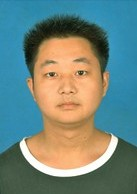

王荣
====

- 男， 汉族， 1988年1月生， 现居北京

- 电话: 13241803747

- 邮箱: wangrong@hust.edu.cn

- GitHub: github.com/lovewuxu

教育背景
--------

- 2007.09 - 2011.07， 黄石理工学院， 生物工程， 本科

- 2012.09 - 2015.07， 华中科技大学， 软件工程， 硕士 

- 主修课程: C语言、数据结构、数据库系统设计与实现、Java程序设计、现代信息检索技术、
            
	    面向对象技术、高级软件工程、高等工程数学、大数据、数据挖掘、项目管理

技能知识
--------

- 编程语言: Java、Hapdoop、Python、 C、Javascript、Linux、Oracle RAC等

- 开发工具: Vim编辑器、Git、GitHub、Source Insight 、Eclipse、ADT、SVN、Tomcat等

项目经验
--------
- 2013.06 - 至今 **XX云平台研发** 
<description> 项目描述：基于Hadoop框架，处理海量并发数据存储。
              主要工作：基于关系数据库的数据存储系统设计、优化和开发
</description>

- 2014.01—2014.06 **HH3C WLAN MIB项目**
<description>	项目描述：WLAN MIB是运营商管理大量无线设备的主要配置手段，此项目基于华三公司Comware V7平台，使用标准C语言开发，使用Linux编译环境，使用自动化测试工具。此项目基于SNMP协议，在WLAN MIB的实现中，SNMP插件需要同各个WLAN后台模块交互，实现MIB节点，实现MIB Browser对网络设备的管理。
	        主要工作：参加设计和编码、测试及敏捷开发数据管理工作。
</description>

- 2013.01 - 2013.03 **老年人保健大师**
<description> 项目描述：老年人保健大师软酷网工程实训项目，是希望通过一系列电脑小游戏来协助老年人积极做好预防和康复工作，降低患上老年痴呆症的风险。项目采用SSH三大框架，运用MVC分层思想。前端表现层使用Jsp、Html、JS技术，数据库采用MySql。业务层使用Spring框架，逻辑控制使用Struts2框架，DAO层使用Hibernate框架。
              主要工作：扮演项目经理角色，负责项目设计、管理、编码、文档编写工作。
</description>

- 2012.08 - 2013.03 **联通手机外勤管理系统**
<description>	项目描述：项目基于B/S模式，应用MVC思想，采用SSH框架， Struts2实现功能的逻辑控制，Hibernate应用在DAO层，Spring应用在业务层，负责完成对象实例化和注入操作。数据库采用MySql。手机android端手机通过ApacheCXF向外提供访问接口，并将这些接口交给spring进行管理。实现功能：提供了销量报表、拜访管理、客户管理、定位管理、工作考勤及灵活查询统计功能与报表输出功能，并且能对员工进行定位管理。
	        主要工作：负责部门管理模块的开发、测试及整理数据报等工作。
</description>

实习与奖励
----------

- 2014.01 - 2014.03 **华中科技大学工程实训**
<description>优秀项目经理奖
</description>

- 2013.06 - 2013.07 **黄石理工学院**
<description>获2009-2010年度优秀学生</description>

其它
----

- 爱好: 滑冰、羽毛球、旅游、写博客、写日记等

- 特长: 编程

自我评价
--------

- 积极向上、热爱自由、崇尚开源、待人友善、富有激情

